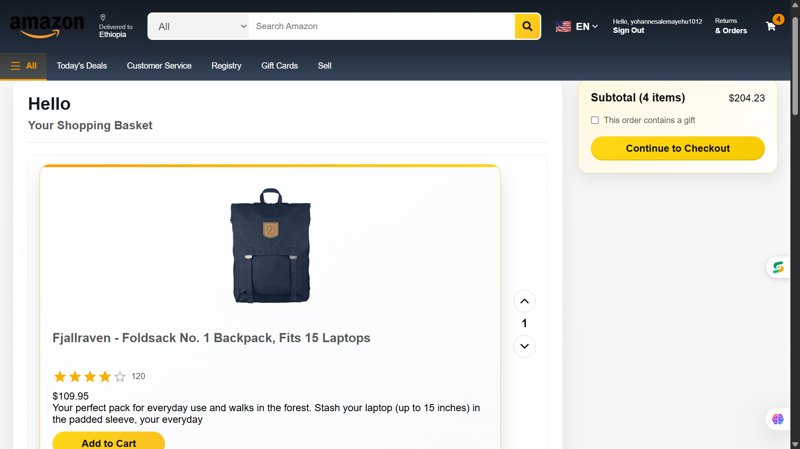
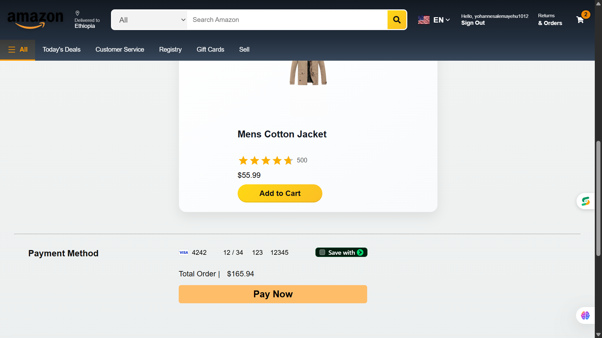
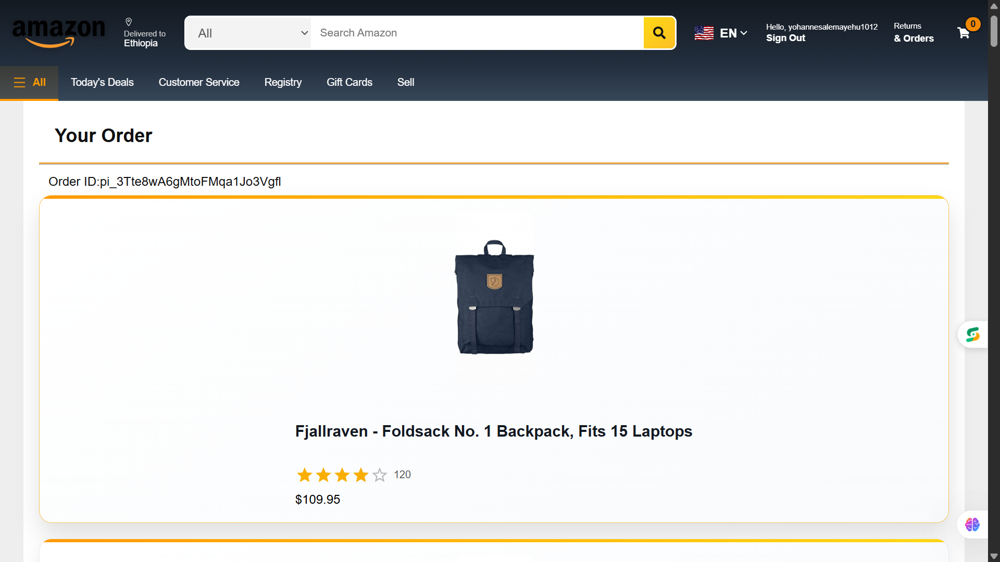

 # 🛒 Amazon Clone - Full Stack E-Commerce Application

A modern full-stack Amazon-inspired e-commerce web application built with **React**, **Node.js**, **Express**, **PostgreSQL**, **Drizzle ORM**, **Firebase Authentication**, and **Stripe**.

This project was developed over the course of **one month** to strengthen my full-stack web development skills, covering everything from frontend development to backend APIs, database management, authentication, payment integration, and deployment.

---

## 🚀 Live Demo

### Frontend
https://amazon-clone-six-rho-44.vercel.app/

### Backend API
https://amazon-api-2xwv.onrender.com

---

## 📸 Screenshots

> Add screenshots inside a `/screenshots` folder.## 📸 Screenshots

### Home Page


### Sign Up


### Cart



### Checkout


### Payment



### Orders




---

# ✨ Features

- User Authentication (Firebase)
- Browse Products
- Product Details
- Add to Cart
- Remove from Cart
- Quantity Management
- Responsive Design
- Stripe Payment Integration
- REST API
- PostgreSQL Database
- Secure Backend
- Full Deployment

---

# 🛠️ Tech Stack

## Frontend

- React.js
- JavaScript (ES6+)
- CSS3
- Context API
- Axios
- React Router

## Backend

- Node.js
- Express.js

## Database

- PostgreSQL
- Drizzle ORM

## Authentication

- Firebase Authentication

## Payment

- Stripe API

## Deployment

- Netlify
- Render

## Version Control

- Git
- GitHub

---

# 📂 Project Structure

```
amazon-clone
├── .firebaserc
├── .gitignore
├── .hintrc
├── README.md
├── firebase.json
├── functions
│   ├── .env
│   ├── .eslintrc.js
│   ├── .gitignore
│   ├── index.js
│   ├── package-lock.json
│   └── package.json
├── main.py
├── package-lock.json
├── package.json
├── public
│   ├── favicon.ico
│   ├── index.html
│   ├── logo192.png
│   ├── logo512.png
│   ├── manifest.json
│   └── robots.txt
└── src
    ├── Api
    │   ├── axios.js
    │   └── endPoints.js
    ├── App.js
    ├── Components
    │   ├── Carousel
    │   │   ├── Carousel.jsx
    │   │   ├── Carousel.module.css
    │   │   ├── data.js
    │   │   └── img
    │   │       ├── 1.jpg
    │   │       ├── 2.jpg
    │   │       ├── 3.jpg
    │   │       ├── 4.jpg
    │   │       └── 5.jpg
    │   ├── Category
    │   │   ├── Category.jsx
    │   │   ├── CategoryCard.jsx
    │   │   ├── catagory.module.css
    │   │   └── catagoryFullInfos.js
    │   ├── CurrencyFormat
    │   │   └── CurrencyFormat.jsx
    │   ├── DataProvider
    │   │   └── DataProvider.jsx
    │   ├── Footer
    │   │   ├── Footer.jsx
    │   │   └── Footer.module.css
    │   ├── Header
    │   │   ├── Header.jsx
    │   │   ├── Header.module.css
    │   │   └── LowerHeader.jsx
    │   ├── LayOut
    │   │   └── LayOut.jsx
    │   ├── Loader
    │   │   └── Loader.jsx
    │   ├── Product
    │   │   ├── Product.jsx
    │   │   ├── Product.module.css
    │   │   └── ProductCard.jsx
    │   ├── ProtectedRoute
    │   │   └── ProtectedRoute.jsx
    │   └── screenshots
    │       ├── 1.Home Page.png
    │       ├── 2.Sign Up.png
    │       ├── 3.Product.png
    │       ├── 4.Cart.png
    │       └── Order.png
    ├── Image
    │   ├── Fashin.jpg
    │   ├── Tv.jpg
    │   ├── amazon-1logo.png
    │   ├── amazon-logo.png
    │   └── flag.jpg
    ├── Pages
    │   ├── Auth
    │   │   ├── Auth.jsx
    │   │   └── Auth.module.css
    │   ├── Cart
    │   │   ├── Cart.jsx
    │   │   └── Cart.module.css
    │   ├── Landing
    │   │   └── Landing.jsx
    │   ├── Orders
    │   │   ├── Orders.jsx
    │   │   └── Orders.module.css
    │   ├── Payment
    │   │   ├── Payment.jsx
    │   │   └── Payment.module.css
    │   ├── ProductDetail
    │   │   ├── ProductDetail.jsx
    │   │   └── ProductDetail.module.css
    │   └── Results
    │       ├── Results.jsx
    │       └── Results.module.css
    ├── Router.jsx
    ├── Utility
    │   ├── action.type.js
    │   ├── firebase.js
    │   ├── reducer.js
    │   └── reducer.test.js
    ├── index.css
    └── index.js
```

---

# ⚙️ Installation

## Clone Repository

```bash
git clone https://github.com/yohannesalemayehu1012/amazon-clone.git
```

Move into the project

```bash
cd amazon-clone
```

---

## Frontend Setup

```bash
cd amazon-clone

npm install

npm start
```

Runs on

```
http://localhost:3000
```

---

## Backend Setup

```bash
cd amazon-api

npm install
```

Create a `.env` file

```env
PORT=5001

DATABASE_URL=your_database_url

STRIPE_SECRET_KEY=your_secret_key

FIREBASE_API_KEY=your_api_key
```

Run the backend

```bash
npm run server
```

Runs on

```
http://localhost:5001
```

---

# 💳 Stripe Test Card

```
Card Number:
4242 4242 4242 4242

Expiry:
Any future date

CVV:
Any 3 digits

ZIP:
Any 5 digits
```

---

# 📚 What I Learned

Throughout this project, I learned how to:

- Build a full-stack web application
- Design RESTful APIs
- Connect React with Express
- Manage application state
- Integrate Stripe payments
- Use Firebase Authentication
- Connect PostgreSQL using Drizzle ORM
- Deploy frontend and backend applications
- Debug production issues
- Work with Git and GitHub professionally

---

# 🚀 Future Improvements

- Wishlist
- Order History
- Product Search
- Product Reviews
- Admin Dashboard
- Inventory Management
- User Profile
- Dark Mode
- Email Notifications

---

# 📦 Deployment

Frontend

Vercel

Backend

Render

Database

PostgreSQL

---

# 👨‍💻 Author

**Yohannes Alemayehu Daba**

Software Engineering Student

Arba Minch University

GitHub:
https://github.com/Kenna-Maamiyeee

LinkedIn:
https://www.linkedin.com/in/yohannes-alemayehu-5004a3371/

Email:
 yohannesalemayehu1012@gmail.com
---

# ⭐ Support

If you like this project, please consider giving it a ⭐ on GitHub.

It motivates me to continue building and sharing more projects.

---

## 📄 License

This project is created for educational and portfolio purposes.
